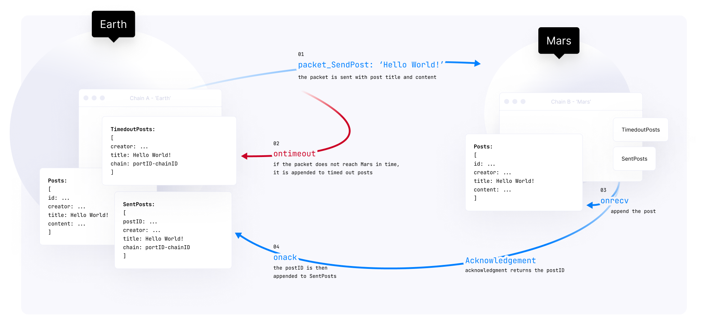

# Terra Rapid Grant Proposal

## Terra <> Stargaze NFT IBC relayer
Project Name: **Terra <> Stargaze NFT IBC relayer**
Team Name: **TerraMoons and Stargaze**
Payment Address: **tbd**

### Project Overview
The end product is a production grade IBC relayer for NFTs from Terra to Stargaze, and also back from Stargaze to Terra. This will be the first working inter blockchain cosmos nft bridge.

Terra was built on Cosmos, but it behaves like a silo right now, with limited connectivity to Osmosis. CW20 tokens (Luna, UST) can be transferred between Solana, Eth through the wormhole. There is no production grade option for NFT transfers between chains. Adding NFT bridges between chains can increase liquidity and expose a path for further utility with interchain smart contract functionality.

Stargaze, a new Cosmos NFT marketplace, would like Terra community feedback for proposals or concerns when building the cw721-ics721 IBC relayer. It makes sense since Terra has a vibrant NFT community. It’s also a good proof of concept to incrementally connect other Cosmos zones such as Juno or Osmosis through IBC relayers.

### Project Details
IBC diagram of “hello world” from earth to mars, and receiving ack message. IBC borrows from TCP/IP, where all the security checks are done on-chain before packages are split and sent to the relayer. Then security checks are completed before submitting the acknowledgement on the receiving chain’s side.

### Specs and existing repos
cw721-ics721 borrows a lot of code and ideas from cw20-ics20: https://docs.cosmwasm.com/docs/0.14/ibc/cw20-ics20/
https://github.com/CosmWasm/cw-plus/tree/main/contracts/cw20-ics20/src
Proposed ICS721 spec https://github.com/cosmos/ibc/pull/615
Relayers: 
Rust https://github.com/informalsystems/ibc-rs
Ibc-go https://github.com/cosmos/ibc-go
Ts-relayer (not currently maintained)
Keplr wallet integration:
cw20 transactions using IBC relayer can be done through direct smart contract messages, but is easiest handled through the keplr wallet ux
https://github.com/chainapsis/keplr-wallet/issues/233

### Development scope
- cw721-ics721 smart contract needs to be written, tested, deployed on terra and stargaze blockchains. *Codebase could be generalized for IBC onto other cosmos zones. 
- ibc-rs requires modification for cw721 compatibility
Typescript sdk examples for smart contract msgs. These scripts can be used in Keplr wallet integration or as a stand alone webapp.
- keplr wallet ux for instantiating and completing nft transfer (similar to cw20-ics20 transfer)
- All cw721-ics721 and relayer code requires development in rust. Demo messages for smart contract interactions in typescript, and Keplr wallet integration in typescript.

### Limitations
- If consensus can not be reached with either cosmos ibc, keplr wallet, or terra, we will have to launch the product as a working demo.
- Running a production grade relayer is a cost area. There may be ongoing costs to upgrading and maintaining the relayer, requiring ongoing grant requests.
- ICS721 spec is a moving target. Maintenance and upgrading smart contract costs may require additional development time and ongoing grants.
- If IBC development hits development roadblocks in unforeseen edge cases or integration edge cases, Keplr wallet integration may be pushed back to prioritize releasing a robust relayer.

### PoC
Successfully implemented hermes bridge example: https://hermes.informal.systems/tutorials/local-chains/relay-paths/multiple-paths.html
https://bitbucket.org/yubrew/cw-nfts/src/main/ modifying, deploying cw-nfts rust contract
Writing nextjs app for https://mint.terramoons.xyz/

### Ecosystem Fit
This project fits into the greater mission of multichain maxi's and spreading the Lunatics gospel across the blockchain galaxy.

There are three basic use cases:
1. NFT users on Terra that want more sources of liquidity
2. Terra dapp and protocol devs that want a working example of IBC beyond the basic cw20-ics20 example. This IBC example can be extended to more advanced interblockchain smart contract functionality. It could extend to defi applications ex: depositing mSol in Anchor and getting Terra rewards.
3. Cosmos devs who want to see a production ready IBC connecting to a very active Cosmos hub, Terra.

NFT creators and users should be able to capture utility across multiple chains. IBC relayers for NFTs is one step towards that future.

Wormhole is an example bridge that works for CW20 tokens like Luna and UST, but it may require significant refactoring to allow transferring NFTs to and from the current chains (ETH, Solana, Terra). The approach suggested in this grant is different. We suggest horizontal compatibility first, building consensus towards an NFT transfer standard and then applying it to other chains.

We are not aware of any other projects addressing multichain transferring of NFTs.
### Team Members
Shane

John Yu - john@terramoons.xyz

### Contact
Shane

John Yu - john@terramoons.xyz

### Legal Structure

### Team’s Experience
John Yu - 6 years web development, internet application development. 6 months solidity / rust development on ethereum, terra blockchains. Developed, launched Terra Moons NFT to selling out the collection in 1.5 days. 

### Team Code Repos
https://bitbucket.org/yubrew https://github.com/yubrew
https://github.com/public-awesome

Team LinkIn Profiles
https://www.linkedin.com/in/johnyu2/

### Development Roadmap
**Overview**
Total Estimated Duration: ~2 months
Full Time Equivalent: 1.5 FTE
Total Costs: $30k, $500/mo to maintain relayer

Milestone 1 cw721-ics721 smart contract
- Estimated duration 1 month
- FTE: 2
- Costs: 15k

| Number      | Deliverable | Specification |
| ----------- | ----------- | ---- |
| 0a.      | License       |  MIT |
| 0b.   | Documentation        | We will provide both inline documentation of the code and a basic tutorial that explains how a user can deploy and use the smart contract. |
| 0c.   | Testing Guide        | Core functions will be fully covered by unit tests to ensure functionality and robustness. In the readme, we will describe how to run these tests. |
| 0d.   | Docker        | This is not needed for a smart contract. `cargo test` and deploying the smart contract should suffice. |
| 1.   | cw721-ics721 smart contract        | We will create a rust smart contract with docker optimized wasm binary uploaded to terra testnet (currently bombay-12). It will pass all tests, provide use cases and edge cases for functionality of transmitting NFTs across chains. If the transaction is successful, the contract receives and burns the NFT in order to allow minting on a different chain. |

Milestone 2 ibc relayer
- Estimated duration: 2 weeks
- FTE: 2
- 10k

| Number      | Deliverable | Specification |
| ----------- | ----------- | ---- |
| 0a.      | License       |  MIT |
| 0b.   | Documentation        | We will provide both inline documentation of the code and a basic tutorial that explains how a user can spin up a relayer to send test transactions. |
| 0c.   | Testing Guide        | Core functions will be fully covered by unit tests to ensure functionality and robustness. The test coverage will be similar to that of ibc-rs |
| 0d.   | Docker        | A Dockerfile will be provided to spin up a test relayer, similar to the example hermes/gaiad test documentation. |
| 1.   | ibc relayer        | We will connect the relayer to the smart contracts deployed in Milestone 1. If the transaction is successful, the contract receives and burns the NFT in order to allow minting on a different chain. The receiving wallet will receive a new NFT and pointers to the original collection information as dictated by ICS721 specs. The relayer functionality will be demonstrated on testnet. |

Milestone 3 keplr wallet integration
- Estimated duration: 2 weeks
- FTE: 1
- 5k

| Number      | Deliverable | Specification |
| ----------- | ----------- | ---- |
| 0a.      | License       |  MIT |
| 0b.   | Documentation        | We will provide both inline documentation of the code and a basic tutorial that explains how a user can use the keplr wallet to send nfts across different cosmos zones. |
| 0c.   | Testing Guide        | Core functions will be fully covered by unit tests to ensure functionality and robustness. The test coverage will be similar to using ibc to send cw20 tokens. |
| 0d.   | Docker        | A Dockerfile will not be provided as this is a chrome extension / mobile wallet integration. |
| 0e.   | Article        | A descriptive guide on how to use the deployed smart contracts, relayer, and keplr wallet will be provided. This will also include basic troubleshooting. |
| 0e.   | Article        | A descriptive guide on how to use the deployed smart contracts, relayer, and keplr wallet will be provided. This will also include basic troubleshooting. |
| 1.   | keplr wallet nft transfer        | We will create a keplr wallet nft transfer that points to the proper smart contract addresses, constructs correct syntax messages to send the nft across the relayer in testnet across chain. The receiving wallet address will receive a new NFT with the same information across chain. |

### Future Plans
We suggest horizontal compatibility first between Cosmos zones, building consensus towards an NFT transfer standard and then applying it to other chains. This may expand to ETH and other EVM chains, Solana, Polkadot, etc.

Develop 721 standard to transfer and enforce royalties across chain.

Open Source infrastructure codebase to allow the possibility of transferring NFTs from outside Terra to marketplaces in Terra such as Knowhere Art, Random Earth, Talis, etc.

### Additional Information
This rapid grant program was recommended by long time Lunatic GT Capital @SebNondzee 